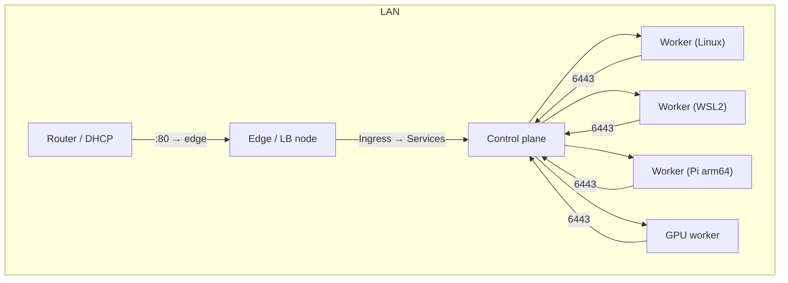

# homelab-k3s

General-purpose documentation and scripts for a small **k3s** homelab cluster: one control plane, optional GPU and burst workers, and a dedicated edge node for LAN ingress.

GitHub PAT for push/clone: copy [.env.github.example](.env.github.example) to `.env.github` (gitignored).


All examples use placeholders — replace with your own hostnames, IPs, and keys. **Never commit real credentials.**

## Architecture



| Role | Purpose |
|------|---------|
| Control plane | Single k3s server, cluster API on `:6443` |
| Workers | Linux native, WSL2, or Raspberry Pi agents |
| GPU worker | Optional NVIDIA workloads via device plugin |
| Edge node | Terminates HTTP(S) on LAN; forwards to in-cluster ingress |

## Quick start

1. **Prepare nodes** — [docs/node-prep.md](docs/node-prep.md): SSH key-only auth, passwordless sudo for automation user.
2. **Install control plane** — [docs/k3s-server.md](docs/k3s-server.md): single server, Traefik disabled, UFW for SSH + 6443.
3. **Join workers** — [docs/k3s-workers.md](docs/k3s-workers.md): native Linux, WSL2, or Pi.
4. **Edge ingress** (optional) — [docs/edge-ingress.md](docs/edge-ingress.md): router `:80` → dedicated LB → Kubernetes ingress.
5. **GPU workers** (optional) — [docs/gpu-workers.md](docs/gpu-workers.md): NVIDIA device plugin and scheduling.

### Scripts

| Script | Description |
|--------|-------------|
| [scripts/install-automation-key.sh](scripts/install-automation-key.sh) | Install cluster automation pubkey on a node |
| [scripts/join-k3s-agent.sh](scripts/join-k3s-agent.sh) | Join this host as a k3s agent |
| [scripts/join-from-control-plane.sh](scripts/join-from-control-plane.sh) | SCP + SSH join helper from control plane |

Generate a dedicated automation key locally (gitignored):

```bash
ssh-keygen -t ed25519 -C "homelab-cluster" -f homelab
cp homelab.pub homelab.pub.example  # edit example only — never commit the private key
```

## Security model (homelab)

| Choice | Rationale |
|--------|-----------|
| Key-only SSH | No password brute-force |
| Dedicated automation user + NOPASSWD sudo | Agents/scripts run `apt`, `systemctl` without storing passwords |
| Root SSH disabled or key-only | Prefer `<admin-user>` + `sudo` for day-to-day ops |
| UFW default deny | Open only SSH and k3s API (6443) on control plane |
| Placeholders in docs | Safe to publish; fill in locally |

## Verify cluster

From the control plane (or any machine with kubeconfig):

```bash
kubectl get nodes -o wide
kubectl get pods -A
```

## License

Documentation and scripts are provided as-is for personal homelab use.
