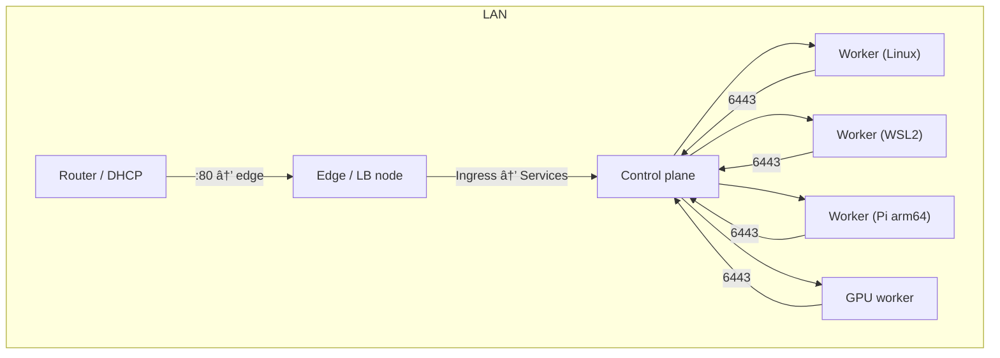

# homelab-k3s

General-purpose documentation and scripts for a small **k3s** homelab cluster: one control plane, optional GPU and burst workers, and a dedicated edge node for LAN ingress.

Copy [.env.example](.env.example) to `.env` and set `GH_TOKEN` for git push/clone. Push with `bash scripts/git-push.sh`.

All examples use placeholders — replace with your own hostnames, IPs, and keys. **Never commit real credentials.**

## Architecture



| Role | Purpose |
|------|---------|
| Control plane | Single k3s server, cluster API on `:6443` |
| Workers | Linux native, WSL2, or Raspberry Pi agents |
| GPU worker | Optional NVIDIA workloads via device plugin |
| Edge node | **blackpearl** — **Caddy** `:80`/`:443` (WAN `*.klaut.pro` + LE); **li-httpd** for `*.homelab.lan`; **step-ca** internal PKI (LAN) |

## Quick start

1. **Prepare nodes** — [docs/node-prep.md](docs/node-prep.md): SSH key-only auth, passwordless sudo for automation user.
2. **Install control plane** — [docs/k3s-server.md](docs/k3s-server.md): single server, Traefik disabled, UFW for SSH + 6443.
3. **Join workers** — [docs/k3s-workers.md](docs/k3s-workers.md): native Linux, WSL2, or Pi.
4. **Edge ingress** — [docs/edge-ingress.md](docs/edge-ingress.md) / [k8s/edge/README.md](k8s/edge/README.md): **Caddy** on blackpearl for WAN (`search.klaut.pro` live); **li-httpd** for LAN hostnames. Fritz **80+443** → `192.168.10.33` ([fritz-klaut-pro-port-forward.md](docs/fritz-klaut-pro-port-forward.md)).
5. **GPU workers** (optional) — [docs/gpu-workers.md](docs/gpu-workers.md): NVIDIA device plugin and scheduling.
6. **Secrets (HCP Vault)** (optional) — [docs/hcp-vault.md](docs/hcp-vault.md): centralize SaaS secrets, sync to k3s via External Secrets Operator.

### Scripts

| Script | Description |
|--------|-------------|
| [scripts/install-automation-key.sh](scripts/install-automation-key.sh) | Install cluster automation pubkey on a node |
| [scripts/join-k3s-agent.sh](scripts/join-k3s-agent.sh) | Join this host as a k3s agent |
| [scripts/join-from-control-plane.sh](scripts/join-from-control-plane.sh) | SCP + SSH join helper from control plane |
| [scripts/hcp-vault-install-eso.sh](scripts/hcp-vault-install-eso.sh) | Install External Secrets Operator for HCP Vault |
| [scripts/hcp-vault-configure-k8s-auth.sh](scripts/hcp-vault-configure-k8s-auth.sh) | Wire Vault Kubernetes auth to homelab k3s |
| [scripts/hcp-vault-onboard-project.sh](scripts/hcp-vault-onboard-project.sh) | Onboard a SaaS project (policy + ExternalSecret) |

Generate a dedicated automation key locally (gitignored):

```bash
ssh-keygen -t ed25519 -C "homelab-cluster" -f homelab
cp homelab.pub homelab.pub.example  # edit example only — never commit the private key
```

## Security model (homelab)

| Choice | Rationale |
|--------|-----------|
| Key-only SSH | No password brute-force |
| Dedicated automation user + NOPASSWD sudo | Agents/scripts run `apt`, `systemctl` without storing passwords |
| Root SSH disabled or key-only | Prefer `<admin-user>` + `sudo` for day-to-day ops |
| UFW default deny | Open only SSH and k3s API (6443) on control plane |
| Placeholders in docs | Safe to publish; fill in locally |

## Verify cluster

From the control plane (or any machine with kubeconfig):

```bash
kubectl get nodes -o wide
kubectl get pods -A
```

## klaut.pro & homelab services (current)

Master inventory (products + NodePorts + WAN): **[docs/klaut-pro-products.md](docs/klaut-pro-products.md#homelab-inventory-current)**.

| Service | Namespace | NodePort | WAN hostname | Status |
|---------|-----------|----------|--------------|--------|
| SearXNG | `searxng` | 30479 | `search.klaut.pro` | Live HTTPS |
| Supabase | `supabase` | 30480 | internal only | Running |
| GitLab CE | `gitlab` | 30481 | `gitlab.klaut.pro` | WAN HTTPS |
| Dependency-Track | `dependency-track` | 30482 | `deps.klaut.pro` | WAN HTTPS |
| CWE mirror | `cwe` | 30483 | `cwe.klaut.pro` | WAN HTTPS (`/manifest.json`) |
| HCP Vault / ESO | `external-secrets` | — | `vault.klaut.pro` | Edge 503; finish `VAULT_*` in `.env` |
| step-ca (internal PKI) | `step-ca` | 30484 | `ca.homelab.lan` (LAN) | ACME for `*.homelab.lan` — not on WAN DNS |
| WAN edge | blackpearl `.33` | 80 / 443 | Fritz → `.33` | Caddy — five `*.klaut.pro` hostnames |

**Products:** `sec-agent` (DT + CWE), `search-api` (`search.klaut.pro`), `vault-api` (HCP pending) — see [docs/klaut-pro-products.md](docs/klaut-pro-products.md).

| Stack | Doc |
|-------|-----|
| klaut.pro products & inventory | [docs/klaut-pro-products.md](docs/klaut-pro-products.md) |
| Supabase | [docs/supabase-launchpad.md](docs/supabase-launchpad.md) |
| GitLab CE | [docs/gitlab-homelab.md](docs/gitlab-homelab.md) |
| OWASP Dependency-Track | [docs/dependency-track-homelab.md](docs/dependency-track-homelab.md) |
| CWE mirror | [docs/cwe-homelab.md](docs/cwe-homelab.md) |
| SearXNG | [docs/search-klaut-pro.md](docs/search-klaut-pro.md) |
| HCP Vault | [docs/hcp-vault.md](docs/hcp-vault.md) |
| Fritz port-forward | [docs/fritz-klaut-pro-port-forward.md](docs/fritz-klaut-pro-port-forward.md) |
| Internal CA (step-ca) | [docs/internal-ca-homelab.md](docs/internal-ca-homelab.md) |

## License

Documentation and scripts are provided as-is for personal homelab use.

