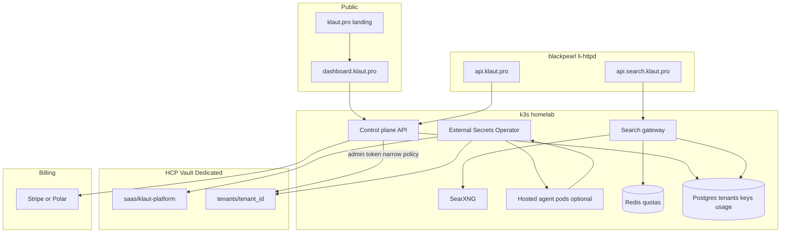

# Klaut agentic platform — architecture

Unified Klaut control plane: **agent search API** ([search.klaut.pro](search-klaut-pro.md)) + **BYOK secrets** ([HCP Vault](hcp-vault.md)) + landing/signup/billing. This doc is the architecture; the three **klaut.pro products** (slugs, Vault paths, Supabase rows, GitLab repos) are in [klaut-pro-products.md](klaut-pro-products.md).

## Verdict: reuse HCP Vault?

**Yes** — for tenant BYOK secrets and platform secrets, with two additions you do not have today:

1. **Tenant path layout** and per-tenant Vault policies (today: `saas/{project}/{env}` for *your* apps only).
2. **A secrets access layer** for customers — either a small **Secrets API** (recommended first) or per-tenant K8s namespaces + ESO for **hosted** agent runners only.

Do **not** give customers admin tokens or the ESO cluster role. Upgrade HCP from **Dev** to **Standard+** before taking paid traffic ([hcp-vault.md](hcp-vault.md#security-notes-homelab)).

---

## Secret classes and Vault paths

| Class | Who owns it | Vault path | How apps read it |
|-------|-------------|------------|------------------|
| **Platform** | Klaut (Stripe, DB, gateway HMAC) | `secret/saas/klaut-platform/prod` | ESO → `klaut-platform` namespace (same as agent-swarm today) |
| **Homelab / internal** | Your projects | `secret/saas/{project}/{env}` | ESO → project namespace ([onboard script](../scripts/hcp-vault-onboard-project.sh)) |
| **Tenant BYOK** | Paying customer | `secret/tenants/{tenant_id}/` | Secrets API or ESO in `tenant-{id}` namespace (hosted runners) |

Example tenant write (control plane only — customers use dashboard or API):

```bash
vault kv put secret/tenants/tnt_abc123 \
  OPENAI_API_KEY=sk-... \
  ANTHROPIC_API_KEY=sk-ant-...
```

Per-tenant policy (template — apply via onboard script variant):

```hcl
path "secret/data/tenants/TENANT_ID" {
  capabilities = ["read"]
}
path "secret/data/tenants/TENANT_ID/*" {
  capabilities = ["read", "list"]
}
```

---

## Auth model

| Actor | Auth | Scope |
|-------|------|--------|
| You / CI | HCP admin or service principal | Bootstrap, policies, seed platform secrets |
| ESO (homelab) | K8s auth, role `external-secrets` | Read `secret/saas/*` (existing) |
| ESO (hosted tenant pod) | K8s auth, role `tenant-{id}` | Read `secret/tenants/{id}/*` only |
| Customer agent (external) | `Authorization: Bearer klaut_sk_...` → **Secrets API** | CRUD own tenant keys; never raw Vault token |
| Customer agent (search) | Same API key on **Search gateway** | Metered `/v1/search` |

**BYOK consumption patterns**

1. **External agents (Cursor, local scripts, customer k8s)** — call `https://api.klaut.pro/v1/secrets/{name}` with API key; gateway validates tenant, reads Vault with a narrow control-plane token, returns value over TLS. Optional: short-lived lease tokens later.
2. **Hosted agents on your k3s** — namespace `tenant-{id}`, ExternalSecret → env vars in pod; no Vault SDK in app code (matches current ESO pattern).

---

## Unified architecture



**Hostnames (suggested)**

| Host | Role |
|------|------|
| `klaut.pro` | Marketing, pricing, docs |
| `dashboard.klaut.pro` | Sign up, API keys, BYOK UI, usage |
| `api.klaut.pro` | Control plane: auth, secrets CRUD, usage |
| `api.search.klaut.pro` | Metered search proxy → SearXNG |
| `search.klaut.pro` | Direct SearXNG (keep LAN/debug; lock down or redirect to gateway for WAN) |

Edge routing follows the same NodePort + [li-httpd](edge-ingress.md) pattern as SearXNG.

---

## How agents consume the product

Single API key (`klaut_sk_live_...`) for both surfaces:

```bash
# Search (metered)
curl -sS 'https://api.search.klaut.pro/v1/search' \
  -H 'Authorization: Bearer klaut_sk_live_...' \
  --get --data-urlencode 'q=latest k3s release' --data-urlencode 'format=json'

# BYOK secret (at runtime — prefer fetching once and caching in memory)
curl -sS 'https://api.klaut.pro/v1/secrets/OPENAI_API_KEY' \
  -H 'Authorization: Bearer klaut_sk_live_...'
```

Agent loop: resolve `OPENAI_API_KEY` from Secrets API → run tool calls → call Search API for grounding. Hosted runners skip the Secrets HTTP hop: keys arrive as env vars from ESO-synced K8s Secret.

---

## Monetization — one product, two meters

Bundle **search quota** and **secrets** so the pitch is “infrastructure for agents,” not two SKUs.

| Tier | Price | Search | Secrets | Notes |
|------|-------|--------|---------|-------|
| **Free** | $0 | 200 searches/mo | 3 keys, 1 tenant | API key required; no SLA |
| **Builder** | $9/mo | 5,000 searches/mo | 10 keys | Self-serve Stripe Checkout |
| **Team** | $29/mo | 30,000 searches/mo | 50 keys, 3 seats | Usage dashboard |
| **Agent infra** | $99/mo | 150,000 searches/mo | Unlimited keys, hosted runner slot | Email SLA |
| **Enterprise** | custom | dedicated SearXNG / Vault namespace | HCP Standard+, invoice | |

Overage: **$2 / 1,000 searches** (see [search-klaut-pro.md](search-klaut-pro.md#suggested-tiers)). Secrets overage (optional): **$0.50 / key / mo** above tier cap.

Implementation hooks:

- **Stripe Billing** or **Polar.sh** — subscription + metered usage (search counts exported daily from Redis/Postgres).
- **One API key** maps to `tenant_id`, plan, and both gateway ACLs.
- **429 responses** include upgrade URL (already sketched in search doc).

---

## Control plane (minimal MVP)

Small service in namespace `klaut-platform` (Go or Node — pick one):

| Component | Responsibility |
|-----------|----------------|
| Postgres | `users`, `tenants`, `api_keys` (hash only), `plans`, `usage_daily` |
| Redis | Sliding-window rate limits for search gateway |
| Control plane API | Signup (magic link or OAuth), key issuance, secrets CRUD → Vault |
| Search gateway | Validate key, increment counter, proxy to SearXNG NodePort |
| Static landing | Astro or plain HTML on `klaut.pro` via li-httpd static or Vercel |

Platform secrets (`STRIPE_SECRET`, `VAULT_TOKEN` with write-only tenant policy) live in `secret/saas/klaut-platform/prod` and sync via existing ESO flow.

---

## Recommended build order

1. **Search gateway only** — `api.search.klaut.pro`, Redis metering, manual API keys in Postgres; proves billing surface. Reuse tier table from [search-klaut-pro.md](search-klaut-pro.md).
2. **Landing + signup** — `klaut.pro`, free tier key issuance, Stripe Checkout for Builder+.
3. **Vault tenant paths** — extend `hcp-vault-onboard-project.sh` (or add `hcp-vault-onboard-tenant.sh`) for `tenants/{id}` policies; control plane writes KV.
4. **Secrets API** — `GET/PUT/DELETE /v1/secrets/{name}` backed by Vault; audit log in Postgres.
5. **Hosted runners (optional)** — per-tenant namespace + ExternalSecret for customers who want agents on your k3s.
6. **HCP tier + hardening** — Standard cluster, restrict public endpoint, rotate admin token, disable raw `search.klaut.pro` on WAN or require gateway.

---

## What not to build yet

- Full multi-tenant agent orchestration (you already have [agent-swarm](../k8s/agent-swarm/) for internal use).
- Vault Agent sidecars or dynamic DB creds — ESO + Secrets API is enough for BYOK API keys.
- Custom billing ledger — Stripe/Polar meters + daily aggregate is sufficient for v1.

---

## Related

- [docs/klaut-pro-products.md](klaut-pro-products.md) — `sec-agent`, `search-api`, `vault-api` product matrix
- [docs/supabase-launchpad.md](supabase-launchpad.md) — self-hosted Supabase on k3s (`supabase` namespace) for klaut.pro platform data
- [docs/hcp-vault.md](hcp-vault.md) — HCP setup, ESO, `saas/*` paths
- [docs/search-klaut-pro.md](search-klaut-pro.md) — SearXNG API, pricing, gateway notes
- [k8s/vault/README.md](../k8s/vault/README.md) — manifests and onboard scripts
- [k8s/searxng/README.md](../k8s/searxng/README.md) — SearXNG deploy
