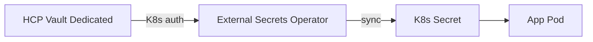

# HCP Vault for homelab SaaS secrets

Centralize secrets for k3s workloads (agent-swarm, majico-staging, future SaaS) in **HashiCorp Cloud Platform (HCP) Vault Dedicated**, synced into Kubernetes with **External Secrets Operator (ESO)**.

Apps keep using normal `Secret` refs — no SDK changes. ESO pulls from Vault on a schedule.

## Why this stack

| Option | Fit for this homelab |
|--------|----------------------|
| **External Secrets Operator** | **Chosen** — matches existing K8s `Secret` + `secretRef` pattern |
| Vault Agent sidecar | Extra pod complexity; use later for dynamic DB creds |
| App SDK (`hvac`, etc.) | Requires code changes in every SaaS repo |

## Architecture



- **Bootstrap / CI**: HCP service principal or short-lived admin token (CLI only).
- **Runtime (k3s)**: Kubernetes auth — ESO authenticates with its service account JWT.
- **KV engine**: `secret/` (v2) with paths under `saas/{project}/{env}/`.

## Manual steps in HCP portal

Do these once before running repo scripts.

### 1. Account and project

1. Sign up at [portal.cloud.hashicorp.com](https://portal.cloud.hashicorp.com).
2. Create or pick an **organization** and **project** (e.g. `homelab`).

### 2. Vault cluster

1. **Vault → Create cluster** (Dev tier is enough for homelab).
2. Pick region close to your LAN (e.g. EU).
3. Wait until status is **Running**.
4. Copy **Public cluster URL** → `VAULT_ADDR` (homelab uses public URL; restrict with HCP network rules if desired).
5. **Generate admin token** once → store in password manager. Use only for bootstrap, not in git or pods.

### 3. Enable KV (if not already)

From a machine with Vault CLI:

```bash
export VAULT_ADDR=https://YOUR-CLUSTER.vault.xxxxx.hashicorp.cloud:8200
export VAULT_NAMESPACE=admin
export VAULT_TOKEN=<admin-token-from-portal>

vault secrets enable -version=2 -path=secret kv   # skip if already enabled
```

### 4. Service principal (optional, for automation)

For non-interactive bootstrap from CI or your PC without admin tokens:

1. HCP portal → **Access control → Service principals → Create**.
2. Grant **Vault Admin** (bootstrap) or narrower custom role after policies exist.
3. Create client credentials → `HCP_CLIENT_ID` / `HCP_CLIENT_SECRET` in local `.env` (never commit).

Login:

```bash
export HCP_CLIENT_ID=...
export HCP_CLIENT_SECRET=...
vault login -method=oauth2 role=project-owner
# or use hcp auth login && hcp vault secrets ...
```

## Secret path layout

KV v2 mount: `secret`. Logical paths (ESO `remoteRef.key` uses the path **without** `data/`):

| Vault path | Purpose |
|------------|---------|
| `saas/agent-swarm/staging` | Cursor, GitHub, Supabase keys for agent-swarm |
| `saas/agent-swarm/prod` | Production agent-swarm |
| `saas/majico/staging` | Majico staging app secrets |
| `saas/majico/prod` | Majico production |
| `saas/sec-agent/{env}` | GitHub security agent ([launchpad-products.md](launchpad-products.md)) |
| `saas/search-api/{env}` | Search gateway (metered API) |
| `saas/vault-api/{env}` | Secrets control plane (BYOK product) |
| `saas/klaut-platform/prod` | Cross-product Stripe, Vault admin, gateway HMAC |
| `saas/_shared/homelab` | Cross-project tokens (e.g. `GH_TOKEN`) — optional |
| `tenants/{tenant_id}` | Customer BYOK keys (**vault-api** only) |

Example write:

```bash
vault kv put secret/saas/agent-swarm/staging \
  CURSOR_API_KEY=replace-me \
  GH_TOKEN=replace-me
```

Policies are scoped per project/env — see `k8s/vault/policies/`.

## Homelab install (k3s on blackpearl)

Run from control plane (or any host with `kubectl` + `helm`):

```bash
cd beelink-cleanup

# 1. Install External Secrets Operator
./scripts/hcp-vault-install-eso.sh

# 2. Configure Vault Kubernetes auth + policies (needs VAULT_ADDR + VAULT_TOKEN in .env)
source scripts/lib/load-env.sh
./scripts/hcp-vault-configure-k8s-auth.sh

# 3. Apply ClusterSecretStore (edit server URL first — copy from example)
cp k8s/vault/external-secrets/cluster-secret-store.example.yaml \
   k8s/vault/external-secrets/cluster-secret-store.yaml
# Edit VAULT_ADDR in cluster-secret-store.yaml, then:
kubectl apply -f k8s/vault/external-secrets/cluster-secret-store.yaml

# 4. Onboard a project (creates Vault policy + ExternalSecret)
./scripts/hcp-vault-onboard-project.sh agent-swarm staging agent-swarm
kubectl apply -f k8s/vault/projects/agent-swarm/external-secret.yaml
```

Verify:

```bash
kubectl get clustersecretstore hcp-vault -o yaml
kubectl -n agent-swarm get externalsecret,secret
kubectl -n agent-swarm describe externalsecret agent-swarm-secrets
```

## Onboard a new SaaS project

1. **Choose names**: `PROJECT` (vault path, e.g. `myapp`), `ENV` (`dev` | `staging` | `prod`), `NAMESPACE` (k8s namespace).
2. **Seed secrets in Vault** (from local `.env`, never commit):

   ```bash
   ENV_FILE=/path/to/myapp/.env.staging \
     ./scripts/hcp-vault-seed-project.sh myapp staging
   ```

3. **Create policy + ExternalSecret manifest**:

   ```bash
   ./scripts/hcp-vault-onboard-project.sh myapp staging myapp-staging
   ```

4. **Edit** `k8s/vault/projects/myapp-staging/external-secret.yaml` if keys differ from defaults.
5. **Apply**: `kubectl apply -f k8s/vault/projects/myapp-staging/external-secret.yaml`
6. **Point deployment** at the synced secret name (same as today — usually `{project}-secrets`).

### Migrating from kubectl secrets

Existing flow (`./scripts/k8s-agent-swarm-secret.sh`) creates secrets directly. To migrate:

1. Seed Vault from the same `.env` with `hcp-vault-seed-project.sh`.
2. Apply the project's `ExternalSecret` (target name `agent-swarm-secrets` keeps deployments unchanged).
3. Remove manual secret script from deploy runbook once ESO sync is verified.
4. Optionally delete the old manually-created secret after ExternalSecret owns it.

## Auth summary

| Actor | Method | Used for |
|-------|--------|----------|
| You / scripts | Admin token or HCP OAuth | Bootstrap, policies, seeding |
| ESO pod | Kubernetes auth (`external-secrets` role) | Sync Vault → K8s |
| App pods | None (read K8s Secret only) | Unchanged |

ESO needs `system:auth-delegator` on its service account so Vault can call the Kubernetes TokenReview API. The configure script and `eso-rbac.yaml` set this up.

## Launchpad products (three slugs)

Each monetizable product gets its own `saas/{slug}/{env}/` path — **do not** share one KV blob across products. Slugs: `sec-agent`, `search-api`, `vault-api`. Onboarding commands and GitLab repo names: [launchpad-products.md](launchpad-products.md).

## Agentic SaaS (customer BYOK)

For **vault-api**, extend paths to `secret/tenants/{tenant_id}/` and add a Secrets API or per-tenant ESO — see [agentic-platform.md](agentic-platform.md). Per-product platform secrets use `saas/{slug}/{env}/`; shared control-plane keys use `saas/klaut-platform/prod`.

## Files in this repo

| Path | Purpose |
|------|---------|
| [docs/launchpad-products.md](launchpad-products.md) | Three products, Vault slugs, Supabase rows |
| [docs/agentic-platform.md](agentic-platform.md) | Unified search + secrets product architecture |
| [k8s/vault/README.md](../k8s/vault/README.md) | Manifest index |
| [k8s/vault/external-secrets/](../k8s/vault/external-secrets/) | ESO namespace, RBAC, ClusterSecretStore example |
| [k8s/vault/projects/](../k8s/vault/projects/) | Per-project ExternalSecret examples |
| [k8s/vault/policies/](../k8s/vault/policies/) | Vault policy HCL templates |
| [scripts/hcp-vault-*.sh](../scripts/) | Install, auth config, onboard, seed |

## Troubleshooting

| Symptom | Check |
|---------|--------|
| `403 permission denied` on ESO | Vault K8s auth config: `token_reviewer_jwt`, CA cert, host URL; ESO has `auth-delegator` binding |
| `invalid audience` (Vault 1.21+) | ClusterSecretStore must set `audiences: [vault]`; Vault role needs matching `audience` |
| ExternalSecret `SecretSyncedError` | Path exists in Vault; policy allows read; `VAULT_NAMESPACE=admin` in store |
| Wrong keys in pod | `remoteRef.property` must match KV field names |

## Security notes (homelab)

- Never commit `VAULT_TOKEN`, admin tokens, or seeded `.env` files.
- Rotate admin token after bootstrap; use policies + K8s auth for day-to-day.
- HCP Dev tier has no SLA — fine for homelab; use Standard+ for anything customer-facing.
- Restrict HCP public endpoint or use HCP network peering if the cluster leaves your LAN.
