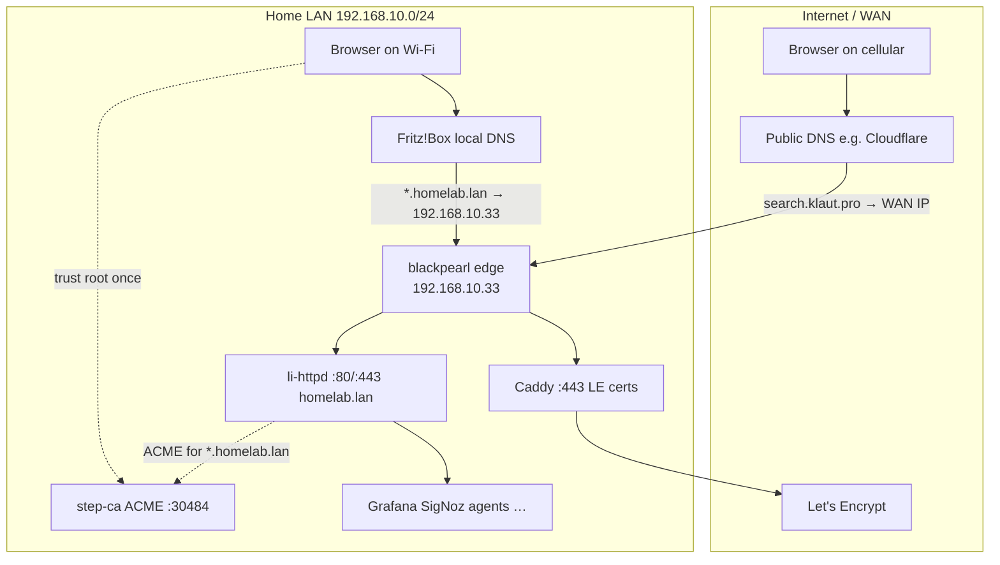

# Internal Certificate Authority (homelab)

Homelab TLS uses **two separate trust paths**. Public services keep **Let's Encrypt**; LAN-only names use a **private CA** (step-ca) that your devices trust after a one-time root install.

## The confusion: why WAN / Fritz does not need internal DNS

**Internal hostnames are not on the public internet.** Names like `grafana.homelab.lan` or `ca.homelab.lan` only exist inside your home network. Let's Encrypt cannot issue certs for them (no public DNS proof), and your Fritz!Box **does not need** to publish them to the world.

What you need instead is **split DNS** (split horizon):

| View | Who resolves | Example query | Answer |
|------|--------------|---------------|--------|
| **LAN** | Fritz local DNS, AdGuard, or CoreDNS forward | `grafana.homelab.lan` | `192.168.10.33` (blackpearl edge) |
| **WAN / Internet** | Public DNS (Cloudflare, etc.) | `grafana.homelab.lan` | NXDOMAIN or nothing |
| **WAN / Internet** | Public DNS | `search.klaut.pro` | Your public IP → Fritz port-forward → Caddy |

LAN clients ask the **router or homelab DNS** for `*.homelab.lan`. Those answers never leave your house. WAN visitors never ask for `*.homelab.lan` because those URLs are not advertised publicly.



## When to use which CA

| Hostname pattern | Certificate source | Edge | WAN exposed? |
|------------------|-------------------|------|--------------|
| `search.klaut.pro`, `gitlab.klaut.pro`, `deps.klaut.pro`, `cwe.klaut.pro` | **Let's Encrypt** (Caddy) | Caddy `:443` | Yes (Fritz 80+443 → `.33`) |
| `*.homelab.lan`, `ca.homelab.lan`, `pki.homelab.lan` | **Internal CA** (step-ca) | li-httpd or direct NodePort | **No** — LAN only |
| `majico.d3bu7.com` | Manual / existing certs on Caddy | Caddy | Yes |

**Do not** replace working LE routes for search/gitlab/deps/cwe. step-ca is only for names that never appear on public DNS.

## Deployed stack

| Item | Value |
|------|-------|
| Namespace | `step-ca` |
| Image | `smallstep/step-ca:0.27.4` |
| NodePort | **30484** |
| In-cluster ACME | `https://step-ca.step-ca.svc.cluster.local:9000/acme/acme/directory` |
| LAN ACME (after DNS) | `https://ca.homelab.lan/acme/acme/directory` |
| Provisioners | `homelab-admin` (JWK), `acme` (ACME) |
| Persistent data | PVC `step-ca-data` (root + intermediate + DB) |

```bash
# From repo root (local kubeconfig or via blackpearl):
./scripts/k8s-step-ca-secret.sh
./scripts/k8s-step-ca-apply.sh

# Push manifests + .env to blackpearl and apply there:
STEP_CA_REMOTE=1 ./scripts/k8s-step-ca-apply.sh
```

Passwords live in `launchpad/.env` as `STEP_CA_PASSWORD` and `STEP_PROVISIONER_PASSWORD` — never commit.

## Fritz!Box: local DNS for `*.homelab.lan`

Goal: every LAN device resolves `*.homelab.lan` (and optionally `ca.homelab.lan`) to **`192.168.10.33`** (k3s edge / Caddy+li-httpd). SSH/admin stays on **`192.168.10.41`**.

### Option A — Wildcard-style local hostname (FRITZ!OS 7.50+)

1. **Heimnetz** → **Netzwerk** → **Netzwerkeinstellungen**
2. Scroll to **DNS-Rebind-Schutz** / local DNS section
3. Under **Lokale DNS-Auflösung** / **Hostnamen im Heimnetz**:
   - Add hostname **`homelab.lan`** or individual hosts (`grafana`, `ca`, `pki`) pointing to **`192.168.10.33`**
4. Some FRITZ!OS versions only allow **one label** per entry — add per service:
   - `grafana.homelab.lan` → `192.168.10.33`
   - `ca.homelab.lan` → `192.168.10.33`
   - `signoz.homelab.lan` → `192.168.10.33`
5. **Anwenden** / save. Renew DHCP on a test client (`ipconfig /renew` / toggle Wi‑Fi).

### Option B — Fritz as DNS, homelab upstream (AdGuard / CoreDNS)

Point Fritz **DNS server** to AdGuard Home or CoreDNS on the cluster; forward `homelab.lan` to a zone file with `A *.homelab.lan 192.168.10.33` (or per-host records). Useful if you outgrow Fritz’s UI.

### DNS-Rebind protection

If local names fail with “rebind” errors, add **`homelab.lan`** to the Fritz **DNS-Rebind-Ausnahmen** (exceptions) list under the same **Netzwerkeinstellungen** page.

### Verify

```bash
# From a LAN machine (should return 192.168.10.33):
nslookup grafana.homelab.lan
nslookup ca.homelab.lan

curl -k https://192.168.10.33:30484/health
curl -H 'Host: grafana.homelab.lan' http://192.168.10.33/health
```

## Trust the root CA on clients

After the first deploy, export the root certificate **once**:

```bash
kubectl -n step-ca exec deploy/step-ca -- step ca root > homelab-root-ca.crt
```

Copy `homelab-root-ca.crt` to each device (USB, secure share, or MDM). **Do not** commit this file to git.

### Windows 10/11

1. Double-click `homelab-root-ca.crt` → **Install Certificate**
2. Store: **Local Machine** (admin) or **Current User**
3. Place in **Trusted Root Certification Authorities**
4. Restart browsers

Or PowerShell (admin):

```powershell
Import-Certificate -FilePath .\homelab-root-ca.crt -CertStoreLocation Cert:\LocalMachine\Root
```

### macOS

```bash
sudo security add-trusted-cert -d -r trustRoot -k /Library/Keychains/System.keychain homelab-root-ca.crt
```

### iOS / iPadOS

1. AirDrop or email the `.crt` to the device
2. **Settings** → **Profile Downloaded** → Install
3. **Settings** → **General** → **About** → **Certificate Trust Settings** → enable full trust for the Homelab CA

### Linux

```bash
sudo cp homelab-root-ca.crt /usr/local/share/ca-certificates/homelab-root-ca.crt
sudo update-ca-certificates
```

## Using ACME with li-httpd / Caddy (LAN)

- **li-httpd** (`*.homelab.lan`): switch from `[server.tls]` self-signed to `[server.tls.manual]` or ACME pointing at step-ca. ACME directory: `https://ca.homelab.lan/acme/acme/directory` (or in-cluster URL for pods).
- **Caddy**: add a **separate site block** only for LAN hostnames with `tls { issuer acme { dir … ca … } }` — keep existing `*.klaut.pro` LE blocks unchanged.

HTTP-01 challenges work when the ACME client listens on `:80` and LAN DNS points at the same edge IP.

## Optional: remote access via WireGuard

Phones/laptops off-LAN can join a WireGuard tunnel into `192.168.10.0/24`, use **internal DNS** (Fritz or AdGuard over the tunnel), install the same root CA, and browse `https://grafana.homelab.lan` as if at home — still **no public DNS** required.

## Backup and recovery

The PVC **`step-ca-data`** contains:

- Root and intermediate keys (encrypted with `STEP_CA_PASSWORD`)
- `ca.json`, provisioner JWK
- Badger certificate database

**If you lose the PVC without a backup, you must re-bootstrap the CA and re-install the root on every client.**

### Backup procedure

```bash
# One-off tarball from the running pod (run from admin workstation with kubectl):
kubectl -n step-ca exec deploy/step-ca -- tar czf - -C /home/step . \
  > step-ca-backup-$(date +%Y%m%d).tar.gz

# Store encrypted offline, e.g.:
gpg -c step-ca-backup-YYYYMMDD.tar.gz
# → step-ca-backup-YYYYMMDD.tar.gz.gpg on USB + cloud vault
```

Also record in your password manager:

- `STEP_CA_PASSWORD`
- `STEP_PROVISIONER_PASSWORD`
- Backup file location and GPG passphrase

### Restore (disaster)

1. Deploy fresh PVC + secret (same passwords as original, or new CA if passwords lost)
2. Copy backup into pod: `kubectl cp step-ca-backup.tar.gz step-ca/<pod>:/tmp/`
3. `kubectl exec … -- tar xzf /tmp/step-ca-backup.tar.gz -C /home/step`
4. Restart deployment; verify `/health` and issue a test cert

## Security notes

- NodePort **30484** is reachable on the LAN; keep UFW LAN-scoped on blackpearl ([homelab-security-ufw-blackpearl-k3s.sh](../scripts/homelab-security-ufw-blackpearl-k3s.sh)).
- Do not port-forward **30484** on Fritz to the internet.
- Internal CA can sign **any** name you authorize via ACME policy — treat `STEP_*` passwords like production key material.

## Related docs

- [k8s/step-ca/README.md](../k8s/step-ca/README.md) — manifests and NodePort
- [k8s/edge/README.md](../k8s/edge/README.md) — Caddy (WAN) vs li-httpd (LAN)
- [edge-ingress.md](edge-ingress.md) — TLS modes for homelab.httpd.toml
- [fritz-klaut-pro-port-forward.md](fritz-klaut-pro-port-forward.md) — WAN 80/443 only for `*.klaut.pro`
