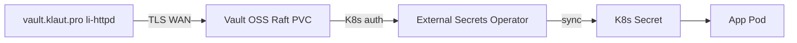

# Vault OSS on homelab k3s

Self-hosted **HashiCorp Vault OSS** (integrated Raft storage) on blackpearl, with **External Secrets Operator (ESO)** syncing KV into Kubernetes `Secret`s. HCP Vault is **not required** for this homelab.

See also: [hcp-vault.md](hcp-vault.md) (legacy HCP notes), [klaut-pro-products.md](klaut-pro-products.md), [k8s/vault/README.md](../k8s/vault/README.md).

## Architecture



| Component | Namespace | Node | Notes |
|-----------|-----------|------|-------|
| Vault server | `vault` | `blackpearl` | StatefulSet, PVC `vault-data`, NodePort **30485** |
| ESO | `external-secrets` | `blackpearl` | Same node as k3s API / Supabase edge |
| ClusterSecretStore | cluster | — | `homelab-vault` → `http://vault.vault.svc:8200` |

## launchpad/.env keys (never commit)

| Key | Purpose |
|-----|---------|
| `VAULT_ADDR` | Public URL: `https://vault.klaut.pro` (CLI/UI) |
| `VAULT_UNSEAL_KEY` | Single shamir key (homelab: 1-of-1); used by unseal sidecar + init script |
| `VAULT_ROOT_TOKEN` | Bootstrap admin; **rotate** after policies + K8s auth |
| `VAULT_TOKEN` | Alias for root token during bootstrap |

Deprecated (comment out if present):

```bash
# HCP — not used in OSS mode
# VAULT_NAMESPACE=admin
# HCP_CLIENT_ID=
# HCP_CLIENT_SECRET=
```

`VAULT_REGENERATE=1` + `VAULT_REGENERATE_CONFIRM=REGENERATE` deletes the Vault PVC and re-inits (destructive).

## One-shot deploy (from your PC)

```bash
cd homelab-k3s
# Ensure launchpad/.env exists; first run creates keys via init on blackpearl
./scripts/k8s-vault-oss-apply-remote.sh all
```

Steps inside `all`:

1. Vault OSS StatefulSet + init/unseal + KV `secret/`
2. ESO Helm install
3. Vault Kubernetes auth + `external-secrets-read` policy
4. Onboard sec-agent, search-api, vault-api ExternalSecrets
5. `vault.klaut.pro` li-httpd + `/healthz` (200 when unsealed + `homelab-vault` Ready)

## Manual steps on blackpearl

```bash
cd ~/homelab-k3s
export LAUNCHPAD_ENV=~/launchpad/.env

./scripts/k8s-vault-oss-apply.sh
./scripts/k8s-vault-oss-init.sh

./scripts/hcp-vault-install-eso.sh
export VAULT_ADDR=http://127.0.0.1:30485
./scripts/hcp-vault-configure-k8s-auth.sh

./scripts/vault-oss-render-cluster-store.sh
kubectl apply -f k8s/vault/external-secrets/cluster-secret-store.yaml
kubectl apply -f k8s/vault/projects/sec-agent/external-secret.yaml
kubectl apply -f k8s/vault/projects/search-gateway/external-secret.yaml
kubectl apply -f k8s/vault/projects/klaut-platform/external-secret.yaml

sudo REPO_ROOT=~/homelab-k3s ./scripts/edge-vault-klaut-status.sh
sudo bash ./scripts/edge-lis-apply.sh
```

## Verify

```bash
kubectl -n vault get pods,pvc,svc
export VAULT_ADDR=http://127.0.0.1:30485
vault status   # Sealed false, Initialized true

kubectl get clustersecretstore homelab-vault
kubectl -n sec-agent get externalsecret,secret

curl -sS -H 'Host: vault.klaut.pro' http://127.0.0.1/healthz -w '\n%{http_code}\n'
```

## Secret paths (unchanged)

KV v2 mount `secret/` — same layout as HCP docs: `saas/{slug}/{env}/`, `tenants/{id}/` for vault-api.

Seed from a product `.env`:

```bash
ENV_FILE=/path/to/.env ./scripts/hcp-vault-seed-project.sh sec-agent staging
```

## vault.klaut.pro edge

- HTTP/HTTPS: static status under `/var/lib/caddy/vault-klaut`, Vault UI/API proxied to NodePort **30485**
- `/healthz`: **200** only when Vault is **unsealed** and `ClusterSecretStore/homelab-vault` is **Ready**
- TLS: existing Let's Encrypt cert (same as other `*.klaut.pro` hosts)

## Migration from HCP

1. Deploy OSS stack (above).
2. Export KV from HCP (`vault kv get` / backup) and `vault kv put` into homelab paths.
3. Switch `ClusterSecretStore` to `homelab-vault` (committed ExternalSecrets already reference it).
4. Remove HCP URLs/tokens from `.env`; comment `VAULT_NAMESPACE`, `HCP_*`.

## Files

| Path | Purpose |
|------|---------|
| [k8s/vault/server/](../k8s/vault/server/) | Vault OSS manifests |
| [scripts/k8s-vault-oss-*.sh](../scripts/) | Deploy, init, unseal secret |
| [scripts/k8s-vault-oss-apply-remote.sh](../scripts/k8s-vault-oss-apply-remote.sh) | SSH sync to blackpearl |
| [scripts/vault-oss-render-cluster-store.sh](../scripts/vault-oss-render-cluster-store.sh) | Render gitignored ClusterSecretStore |
| [scripts/edge-vault-klaut-status.sh](../scripts/edge-vault-klaut-status.sh) | `/healthz` + status.json |

## Troubleshooting

| Symptom | Check |
|---------|--------|
| Pod sealed | `kubectl -n vault logs vault-0 -c vault-unseal`; secret `vault-unseal`; `VAULT_UNSEAL_KEY` in `.env` |
| ESO 403 | Re-run `hcp-vault-configure-k8s-auth.sh`; ESO `auth-delegator` RBAC |
| ExternalSecret error | KV path exists; policy `external-secrets-read`; store name `homelab-vault` |
| `/healthz` 503 | `edge-vault-klaut-status.sh` output; unseal + ClusterSecretStore Ready |
